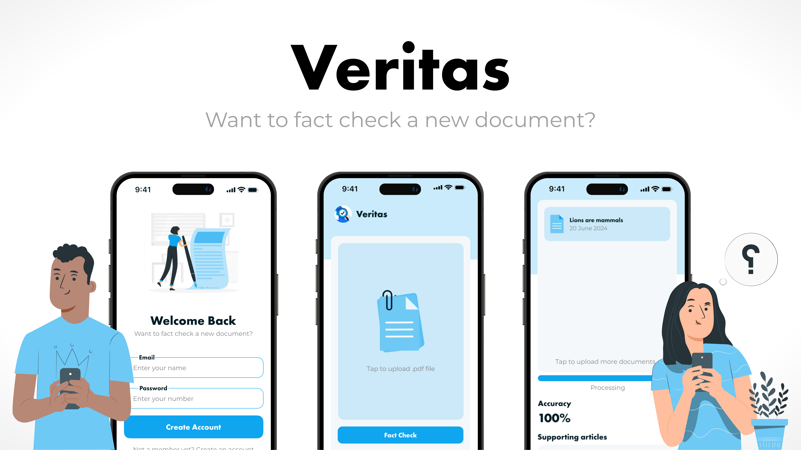

## <p align="center" style="text-decoration: none !important;padding:0;margin:0;">Mareli Lourens<br> 221119 <br> Interactive Development 300 - Term 4</p>

<p align="center">
  
</p>

## <p align="center" style="text-decoration: none !important;padding:0;margin:0;">AI-Driven Application</p>

## Table of Contents

* [About the Project](#about-the-project)
  * [Product mockup](#product-mockup)
  * [Project description](#project-description)
  * [Built With](#built-with)
  * [Languages](#languages)
* [Getting Started](#getting-started)
  * [How to install](#how-to-install)
* [Features and Functionality](#features-and-functionality)
* [Concept Process](#concept-process)
   * [Ideation](#ideation)
* [Development Process](#development-process)
    * [Highlights](#highlights)
    * [Challenges](#challenges)
* [Future Implementation](#future-implementation)
* [Conclusion](#conclusion)
* [Contact](#contact)

## About the project:

### Product mockup:


### Project description:

For my final project as a third-year student, I developed a fact-checking app using Google Firebase and Google Cloud’s AI services. This app is designed to combat misinformation by analyzing document accuracy, providing source credibility ratings, and offering educational tools on media literacy.

Leveraging Google Cloud’s Natural Language processing, the app evaluates the accuracy of uploaded text, comparing it to credible sources and giving a percentage-based accuracy score. Firebase powers the app's backend, handling user authentication, data storage, and real-time updates. This project allowed me to apply AI in a practical way, aiming to promote informed, critical consumption of information in today’s digital landscape.

### Built with:
* [React Native](https://reactnative.dev/)
* [Firebase](https://firebase.google.com/)
* [Google Cloud](https://console.cloud.google.com/welcome/new?project=axial-rigging-439517-j1)

### Languages:
* TypeScript
* JavaScript

## Getting Started:

### How to Install:

Once downloaded, open the folder in your Visual Studio Code and open up the terminal. Then type:

```
cd veritas
npm install
```

## Features and Functionality:

The app begins with a login page, where users can log in or create a new account if they haven’t registered yet. Once logged in, users are directed to the home page, where they can upload a PDF document for analysis. From there, users have two main options: they can navigate to the Fact Check page, where the app analyzes the uploaded text for accuracy using Google Cloud’s AI, providing a percentage accuracy score along with relevant supporting articles. Alternatively, users can go to the Articles page, which suggests articles related to the document’s title or content, enabling them to explore further information and gain additional context.

## Concept Process:

### Ideation:

The idea for this fact-checking app arose from the growing need to combat misinformation in today’s digital world. With so much information readily available online, it can be challenging to discern credible sources from unreliable ones, especially when biased or false content spreads so quickly. I wanted to create a tool that empowers users to critically assess information by providing AI-driven accuracy checks and access to reliable sources. Inspired by this goal, I envisioned an app that would be intuitive to use while leveraging advanced AI technology. By combining Google Cloud’s Natural Language processing capabilities with Firebase's efficient backend, I aimed to create a user-friendly application that would not only verify content but also educate users on media literacy. This vision shaped the app's core functionalities, focusing on simplicity, accuracy, and accessibility.

## Development Process

### Highlights

One of the highlights of developing this fact-checking app was exploring the potential of AI to create real-world impact. I particularly enjoyed working with Google Cloud's Natural Language processing—it was exciting to see how the AI could analyze text accuracy and provide insightful results. Implementing Firebase was also rewarding, as it streamlined user authentication and data management, allowing me to focus more on creating a seamless user experience. Building out the app's different functionalities, from the login and registration pages to the fact-checking and articles sections, was a great opportunity to bring my ideas to life. The project pushed me to think creatively and reinforced my passion for using technology to solve meaningful problems.

### Challenges

One of the main challenges I faced was working with the AI API to achieve reliable accuracy in fact-checking results. Although Google Cloud's Natural Language processing provided a solid foundation, it was difficult to get consistently precise outputs due to the inherent limitations of AI in understanding nuanced information. This meant that while the app could provide a general accuracy score, the results weren't always perfect, especially with complex or ambiguous text. Another hurdle was finding relevant supporting articles; ensuring they were credible and directly aligned with the document's content proved challenging. Despite these obstacles, the experience taught me a lot about handling API limitations and adapting AI outputs to create a functional, user-friendly app.

## Future Implementation

In the future, I’d like to expand the app's functionality to enhance both accuracy and user experience. One potential improvement would be to integrate multiple AI models for cross-referencing information, which could provide more reliable accuracy scores by combining insights from various sources. Additionally, implementing a more advanced algorithm to filter and curate supporting articles would ensure that users receive the most relevant and credible information. Another future feature could include a user feedback loop, allowing users to report inaccuracies in results, which could help the AI model improve over time. 


## Conclusion

Developing this fact-checking app has been a rewarding journey, blending the power of AI with the need for accurate, reliable information in today’s digital age. Throughout the project, I gained hands-on experience with Google Cloud’s Natural Language processing and Firebase, which allowed me to create a functional, user-centered app that addresses the pressing issue of misinformation. Although there were challenges in achieving precise accuracy and curating credible supporting articles, the project taught me valuable lessons in managing AI’s limitations and enhancing user experience. This app is a stepping stone toward using AI responsibly and creatively to empower users with tools for critical evaluation of information. Looking ahead, I’m excited by the potential future implementations, from improving accuracy through multiple AI models to integrating user feedback for continuous improvement. Overall, this project solidified my passion for using technology to make a positive impact and highlighted the importance of accessible, reliable information in fostering an informed society.


## Authors
Mareli Lourens - [Find me on Github](https://github.com/MareliLourens)

## Contact
Mareli Lourens - [Email](mailto:221119@virtualwindow.co.za)

## Project Link
View on GitHub - https://github.com/MareliLourens/Veritas.git

